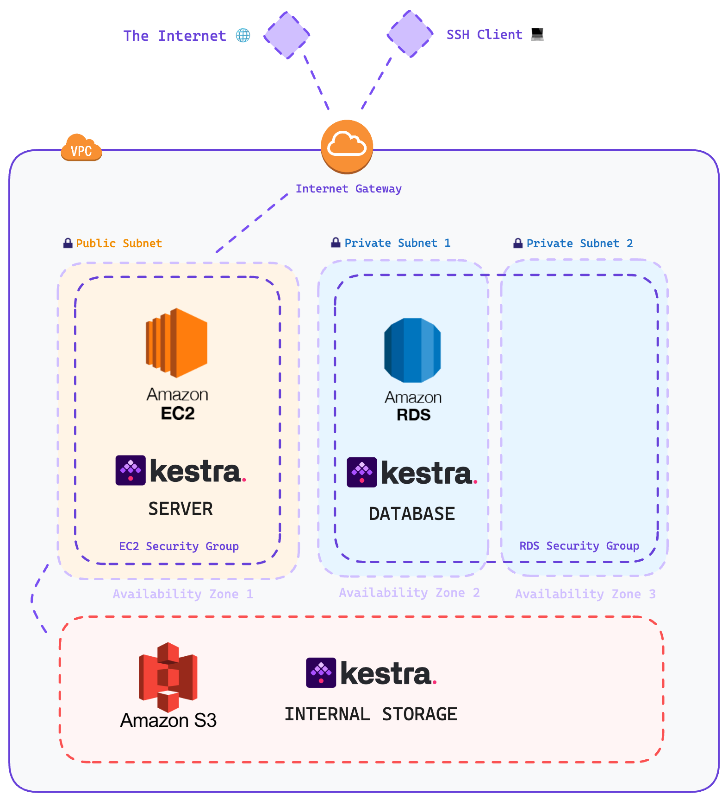

# Deploy Kestra on AWS

This repository contains Terraform files to deploy Kestra on AWS with the following components:
* AWS EC2: to host Kestra server
* RDS Postgres: the Kestra database backend
* AWS S3: the Kestra storage

## Running the Configuration

### Create the Secrets file
Create a secrets file called secrets.tfvars and populate it with the follow secrets:

`db_username`: this is going to be the master user for RDS
`db_password`: this is going to be the RDS master user's password
`my_ip`: this is going to be your public IP
`aws_access_key`: AWS Access Key
`aws_secret_key`: AWS Secret Key

> Note: If you already havea a configured AWS CLI you can remove the `aws_access_key` and `aws_secret_key` from the `main.tf` and `variables.tf`

### Create the Key Pair

To authenticate to your EC2 instance easily you can create a key pair - allowing an SSH tunel connection:

`ssh-keygen -t rsa -b 4096 -m pem -f kestra_kp && openssl rsa -in kestra_kp -outform pem && chmod 400 kestra_kp.pem`

### Initializing the Terraform directory

Run the command: `terraform init`

### Apply the Terraform Config to AWS

Run the command: `terraform apply -var-file="secrets.tfvars"`

> To connect through SSH to your EC2 instance: `ssh -i "kestra_key.pem" ubuntu@$(terraform output -raw web_public_dns)`

### To destroy everything that was created by the Terraform Config

Run the command: `terraform destroy -var-file="secrets.tfvars"`